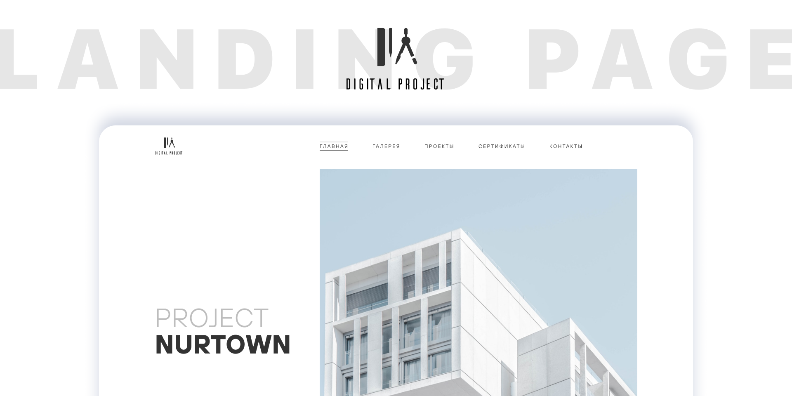

This is a sleek, modern Single Page Application (SPA) built for a conceptual architectural design firm, highlighting clean aesthetics and smooth, responsive navigation. It functions as a live demonstration of proficiency in front-end development using contemporary web technologies and best practices. <a href="https://www.figma.com/design/MVRnFLJlsrNotUkj3gknAj/Website-of-architects---free-website--Community-?node-id=449-49&t=9esTLB5287x8v3c7-0">Figma template</a>.

<h2>Project Features</h2>
The project has several features that are worth paying attention to. 

<h3>Markup & Styles</h3>
<ul>
  <li>
    <b>BEM. </b>The project follows the BEM methodology for structuring SCSS, where each component is broken down into <i>blocks</i>, <i>elements</i>, and <i>modifiers</i>. This approach ensures that the code is modular, scalable, and easy to maintain.
  </li>
  <li>
    <b>Global Styles. </b>The project has <i>_global.scss</i> for global styles, <i>_normalize.scss</i> for resetting default styles, <i>_mixins.scss</i> and <i>_media.scss</i> for comfortable styling and others.
  </li>
  <li>
    <b>CSS Property Grouping. </b> CSS properties are organized in a consistent and logical order to improve readability, maintainability, and ease of debugging.
  </li>
  <li>
    <b>CSS Variables. </b>The project uses css variables throughout styles ensuring maintainability, reusability, and consistency of the code.
  </li>
  <li>
    <b>SCSS. </b>The project is written in the SCSS preprocessor and contains useful features such as mixins for comfortable styling.
  </li>
  <li>
    <b>Accessibility. </b>The project incorporates WAI-ARIA best practices and keyboard navigation to ensure a usable experience for people using assistive technologies.
  </li>
</ul>
